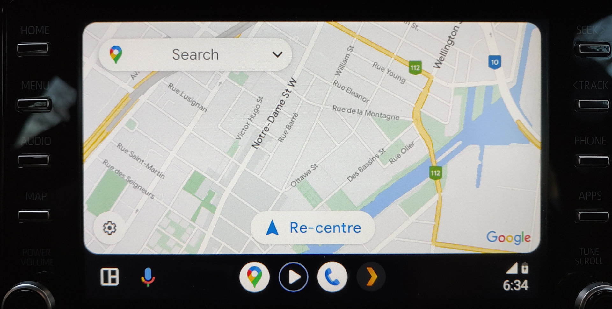
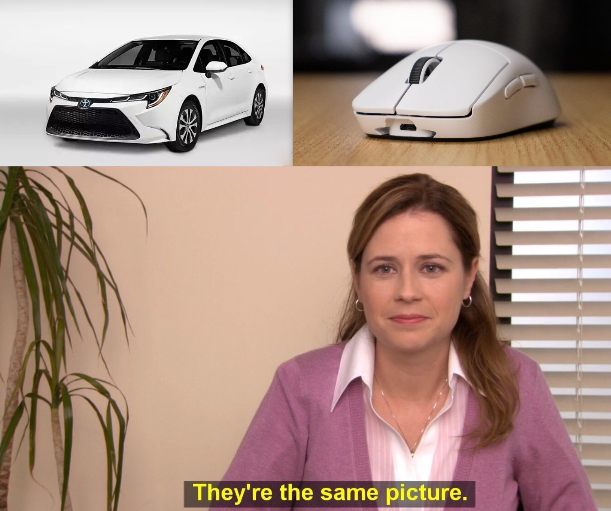

This is a mini review from my limited experience with a loaner 2021 Toyota Corolla. 

This is mostly for my own notes.

## Audio / Infotainment

The base model 6 speaker system is not great. You get door speakers plus windshield firing tweeters in the front, and only door speakers in the rear. The front left tweeter was not working so I can't commend on soundstage. Stock tuning is bad. It has poor bass extension and sounds bloated. At higher volumes it distorts badly with rattling plastic noises. Highs are recessed and lack detail, with vocals taking the back seat. It was somewhat "acceptable" with +1 Treble to bring back the highs and -1 Bass to tame the boosted low end. I should get a calibration microphone to test this stuff... It's clear Toyota did not tune the audio system for audiophiles.

Why don't they use DSP calibration to address this? At least give us a parametric EQ so we can do it ourselves with REW. Other work needs to be done to add rigidity and sound deadening to the door panels to reduce bass distortion. A dedicated subwoofer would relieve the door speakers to focus on the mid range. 

I am curious to hear the JBL sound system available on the XSE trim.

The infotainment is responsive and easy to use. Android Auto setup was a breeze. The interface is snappy, multi-touch works fine. Audio quality over USB is better than Bluetooth. Screen quality could be better, the main issue is the display has a 5mm gap behind the digitizer, and the anti-glare finish adds softness. You can see some blooming around high contrast areas like a white button on a black background for example.

I am thankful Toyota stuck with real buttons!

## Driving Impressions

The Toyota Corolla rides exceptionally well for an entry level car. The seats are comfortable. It rolls over bumps without upsetting the car. The soft suspension makes for a smooth ride. This is an excellent choice for commuting in a city like Montreal filled with potholes. 

The steering wheel is very light and doesn't give much feedback.

The 139 horsepower, 1.8 liter NPC engine is smooth. It's not fast by any means, but adequate for commuting. It's not a race car. I think they increased the power output on the new model.

Visibility is good. The rear view camera has the same quality as a 2000s camcorder.

The information display in the gauge cluster is clear and I like using the digital speedometer. 

The cabin could have better sound isolation from road noise.

## Design

I like the compact size of the Corolla. Ingress and egress were not a problem in the front, but you need to be careful not to hit your head getting in the back. Taller people will probably hit the ceiling. No tall people were available for testing. The missing sunroof removes a point of failure so that gets a thumbs up.

I am not a fan of the piano black gloss plastic in the interior.

The Toyota Corolla looks like a Logitech gaming mouse, and nobody can tell me otherwise.

## Conclusion

It's alright. Don't buy it if you are an audiophile. It's a good commuter, it's not a sports car.