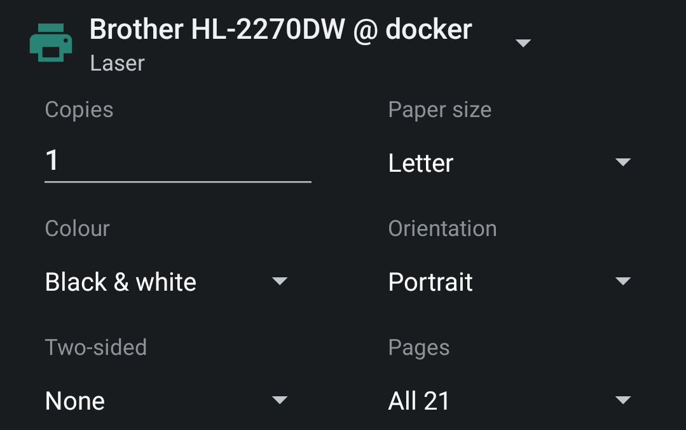

I've got this old but extremely reliable Brother HL-2270DW that has served me well for over a decade. I want to be able to use it driverless on Android and iOS. Enter [CUPS](https://openprinting.github.io/cups/), an open source print server that can bring modern features to any old printer. When combined with Avahi mDNS/DNS-SD you can discover and print seamlessly from your Android or iOS smartphone, tablet, Chromebook, and more.

### Tutorial

First, make sure your locale is set so the expected paper size is selected. The United States and Canada use Legal/Letter size. If you don't set your locale, it will default to A4 size.

``` bash
sudo dpkg-reconfigure locales
# Set to "en_CA.UTF-8" or "en_US.UTF-8"

# Verify the locale is set
# You will need to logout and login for this to apply
locale

# Expected output:
# LC_PAPER="en_CA.UTF-8" or "en_US.UTF-8"
```

Next,
- Install CUPS, Avahi, Brother Laser Driver
- Add your admin user account
- Enable remote Web UI and printer sharing
- Restart CUPS

``` bash
sudo apt install cups avahi-daemon libnss-mdns printer-driver-brlaser 
sudo usermod -a -G lpadmin username
sudo cupsctl --remote-any --remote-admin --share-printers
sudo service cups restart
```

## Web UI Setup

Navigate to `https://server-ip:631/admin`

Click `Add Printer` and select your printer from the list or configure it manually.


Enable `Share This Printer`


Select the driver.


Set the printer options.


Done! The printer should now show up in AirPrint and the Android Default Print Service.



### Troubleshooting Paper Size

If you try printing on an iOS or Android device and Letter Paper is missing, try the following steps:

``` bash
# Set /etc/papersize to "letter"
sudo paperconfig -p letter

sudo vim /etc/cups/cupsd.conf

# Insert the following lines:
# DefaultPaperSize Letter
# DefaultLanguage en_US

# Clear the cache and restart CUPS
sudo rm -r /var/cache/cups/
sudo service cups restart

# Verify media-ready = na_legal_8.5x14in,na_letter_8.5x11in
ipptool -tv ipp://localhost:631/printers/Printer_Name /usr/share/cups/ipptool/get-printer-attributes.test | grep media-ready
```

### Notes

This tutorial was created using CUPS 2.4.2, and Ubuntu Server 23.10.

For Chromebooks try directly connecting to the printer with this address:

```
ipp://printer.local:631/ipp/port1
```

This works better than some who recommend AppSocket on port 9100.