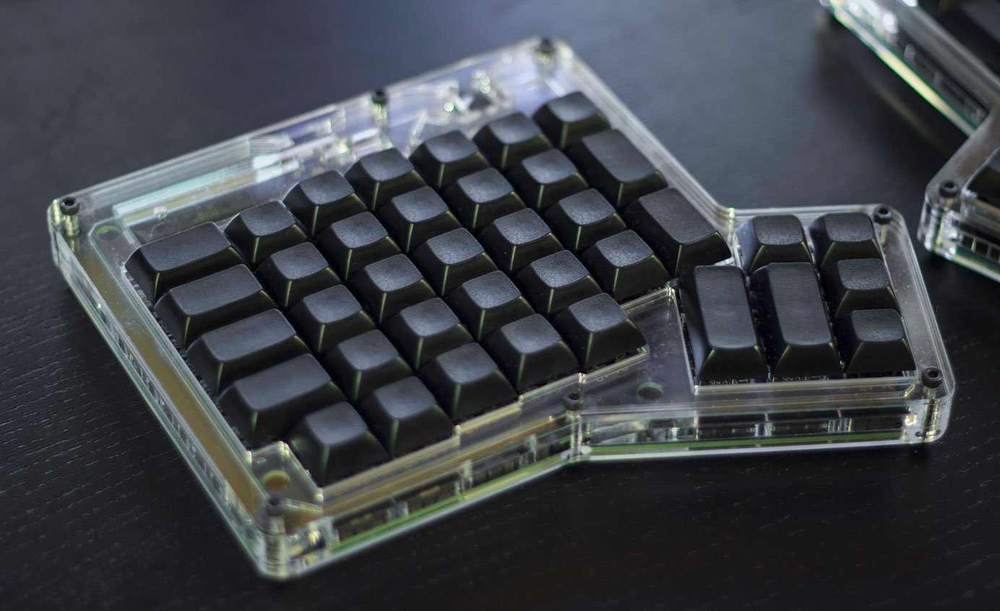
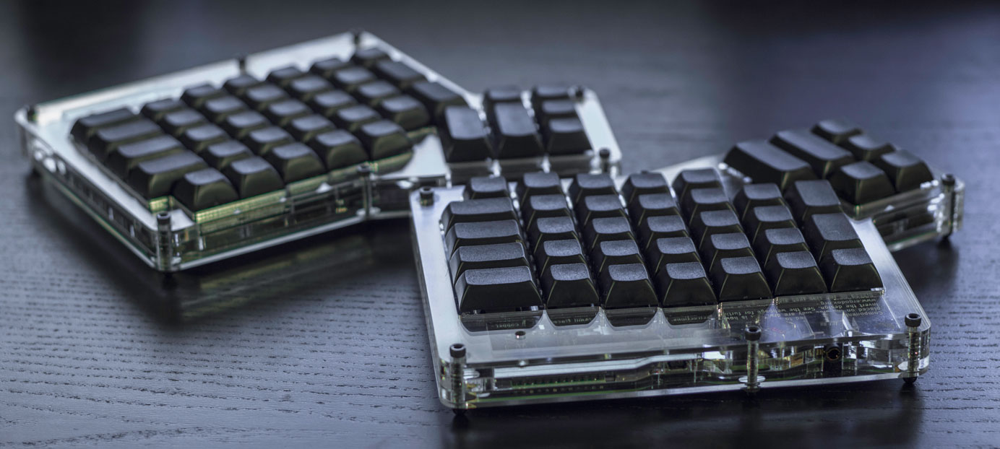
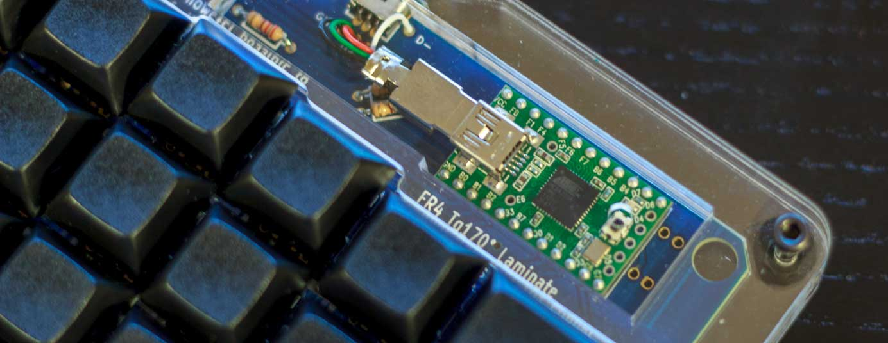

## Preface

A few months back I joined the [Massdrop](https://www.massdrop.com/r/H6WV3U) group buy for the ErgoDox. If you don't know what [Massdrop](https://www.massdrop.com/r/H6WV3U) or a group buy is, basically it allows you to join in on a bulk purchase of a product so the group can get a lower price. Since the ErgoDox requires cooperation from component vendors, a PCB manufacturer, and a company that can do laser cutting, it took absolutely ages for the kit to arrive.

Now this keyboard isn't exactly what I'd call affordable. It costs 200 for the keyboard, $45 extra if you want keycaps, and I think they also have more expensive switch options because they're hard to source (but don't quote me on that because the group buy isn't going on at the time of this review so I can't see the price breakdown).


<iframe width="100%" height="404" src="https://www.youtube.com/embed/oeJk_43UmGQ" frameborder="0" allowfullscreen></iframe>


The hard part was over (I'm very impatient). The kit had finally arrived and it was time to open the damn box. Inside I found all the components I needed to build my very own ErgoDox!

Now while we're here, I'd like to take a minute to explain the alternative to Massdrop when building an ErgoDox. This keyboard's design is licensed under the GNU General Public License v3 which means it's free as in freedom. Since it's free you can download the PCB, case, and a list of parts so you can source your own components. Doing this is faster than Massdrop, but can be more expensive. The benefit however is since the design is free, you can change anything from the colour of the PCB to the design of the case.

Everything you need to get started can be found at [ErgoDox.org](http://ergodox.org/)

## Assembly


<iframe width="100%" height="404" src="https://www.youtube.com/embed/GpCaQGGcdOE" frameborder="0" allowfullscreen></iframe>


If you're new to soldering, I highly recommend checking out the EEVBlog's videos about soldering. I've linked them below:

[Part 1 - Tools](https://www.youtube.com/watch?v=J5Sb21qbpEQ)  
[Part 2 - Through Hole](https://www.youtube.com/watch?v=fYz5nIHH0iY)  
[Part 3 - Surface Mount](https://www.youtube.com/watch?v=b9FC9fAlfQE)  

Things you'll need for the build:  

- Soldering station
- Thin solder. I use 0.031 Diameter 60/40 Rosin Core solder.
- Tweezers
- Side cutters
- Wire strippers
- Good eyes (or a magnifying glass/digital microscope)
- Good lighting so you can see the small components and polarity of the diodes
- Multimeter for troubleshooting 

For my build, I used a Hakko FX888D which I reviewed a while back on my channel. It's a pretty fantastic digitally controlled soldering station that is reasonably priced  at ~$90 [Amazon](http://http://www.amazon.com/gp/product/B00AWUFVY8?ie=UTF8&camp=213733&creative=393185&creativeASIN=B00AWUFVY8&linkCode=shr&tag=ttzl-20&linkId=DXH2PXUJLQRKAGMD&qid=1407337032&sr=8-1&keywords=fx888d)


<iframe width="100%" height="404" src="https://www.youtube.com/embed/Nd1WJ3NZIMI" frameborder="0" allowfullscreen></iframe>


For your build, you'll want to set yourself up in a well ventilated area where you'll have enough space to work and won't be disturbed by anyone or pets who will start messing with small components. =^.^=

The build took a few hours, but most of the time was spent on the surface mount components. It was the first time I'd ever soldered with them and it was a challenge because they're so small. It's not too difficult if you  don't mind some crooked components, but my OCD wants everything as perfect as possible. Speaking of OCD, the case was also a challenge because it's unsurprisingly easy to get dust trapped under the layers of Plexiglas!

## The Review
The first day was hell. I could not type to save my life, but I kept at it, and after two weeks I had mastered it. The reason the ErgoDox comes at a shock is because you're not used to having your hands so far apart, and the keys are in a matrix layout as opposed to a staggered layout found on most keyboards. Some functions like Enter, Backspace and Delete get moved to your thumbs so that'll also take a while to get used to. After you've gotten used to it, it can sometimes be difficult to switch back to a regular keyboard. I experienced this for the first time when I went back to school after using the ErgoDox for a few weeks.

If you've ever been uncertain about what key switch you like, it doesn't really matter with the ErgoDox because you can choose pretty much anything and mix and match as well. Lets say you want all the letter keys to use MX Blue switches, the modifiers to use MX Clears, and the thumb keys to use MX Browns, it doesn't matter with the ErgoDox! You can order switches from DigiKey for a reasonable price if you want to do this.

The ErgoDox was the first keyboard I've ever used with Cherry MX Blue switches and I like them quite a bit. I'm coming from MX Browns on my first keyboard, and I used MX Reds for a short period of time for my Func KB-460 review. I really like the clicky sound because it has helped me tremendously to stop bottoming out. The switch is a little heavier than MX Browns so I tend to get tired faster, but I guess this goes away over time.

### Build Quality

Well this depends mostly on how well the kit is put together, but by design it's build very well. All the keys are plate mounted on a very thick sheet of Plexiglas, the keycaps feel great, the PCB looks stunning, and once put together, the case doesn't flex at all. My only complaint is that the TRRS connectors feel a little cheap, but that can easily be upgraded by sourcing a better component and replacing the stock one. Alternatively, you can even hard wire the two keyboards together.

### Keycaps and Layout

[Massdrop](https://www.massdrop.com/r/H6WV3U) offers either DSA or DCS keycaps for the ErgoDox. I went with the black DSA PBT keycaps for mine and I find them quite comfortable. Signature Plastics offers a variety of Base and Modifier sets for the ErgoDox, so you can customize it to your heart's content. [Signature Plastics](http://http://keyshop.pimpmykeyboard.com/products/full-keysets/dsa-blank-sets-1)

The keys are blank so you can make any layout you want in the layout editor. Since the layout is stored on the keyboard's microcontroller, you can even program an alternative layout such as Dvorak or Colemak and it'll work on any computer you plug the keyboard into without messing with operating system settings. This is good if you carry the keyboard with you and use it on school computers or at your workplace. 

Source: [Massdrop ErgoDox Editor](https://www.massdrop.com/ext/ergodox)

You may have noticed that the ErgoDox doesn't exactly have as many keys as other keyboards. This is to keep the keyboard compact. To compensate for the lack of keys, the keyboard makes use of "layers" to add function keys, a numpad, and whatever else you'd like to include in the layers. I found Massdrop's layout editor easy to use, but if you want to avoid it all together, you can download the source code and program the layout manually.

### Gaming

One issue with the stock layout is that you can't game because the Space key is on the right hand. I changed my layout to move the Space key onto the left hand where the Spacebar would normally be on a regular keyboard. After this tiny modification, the ErgoDox works well for the games I play, but I'm not sure if it'll work for you if you have games that use any letter keys on the right hand. I'm also not a fan of the arrow keys for games like F1 2012 but I opt for a controller for racing games anyways so it doesn't really matter.

### Conclusion
I really like this keyboard.

### Photos

