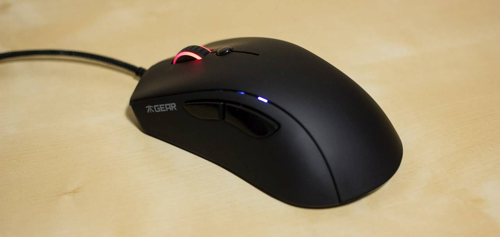
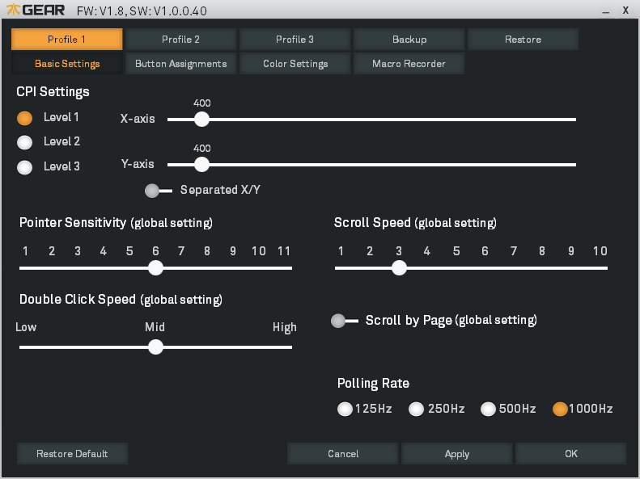
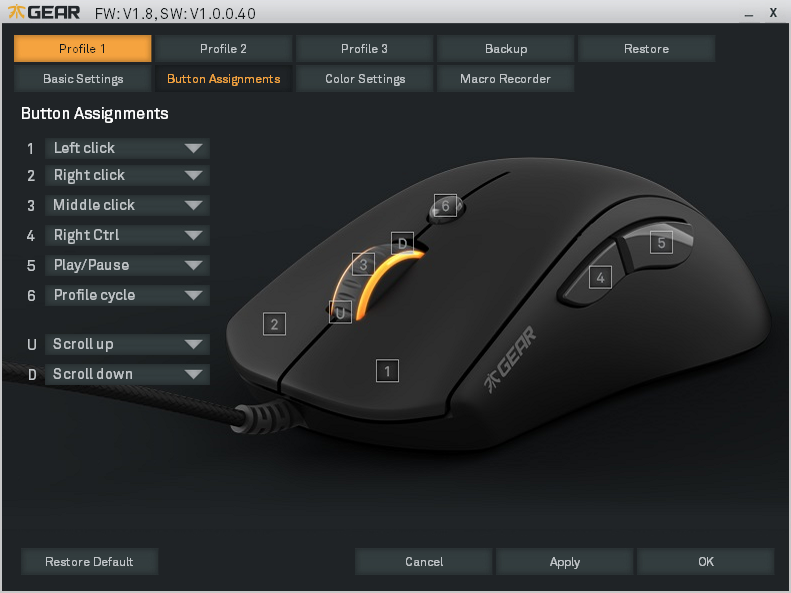
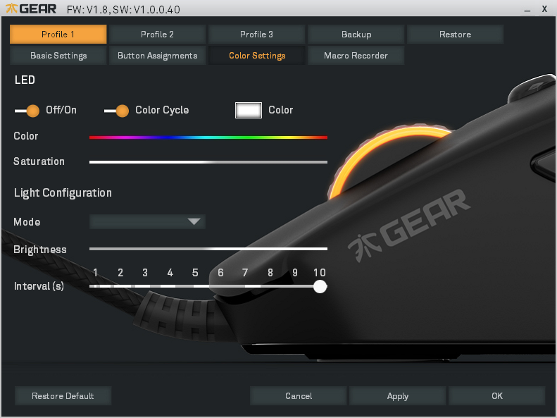
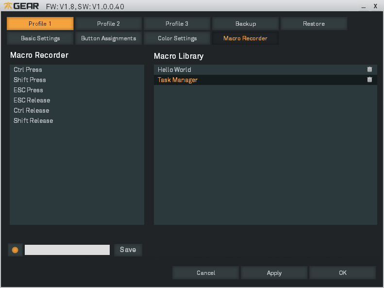
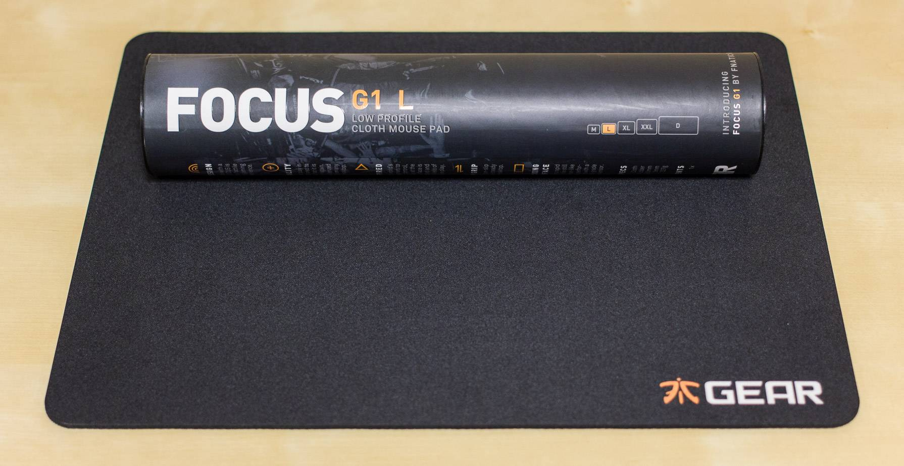
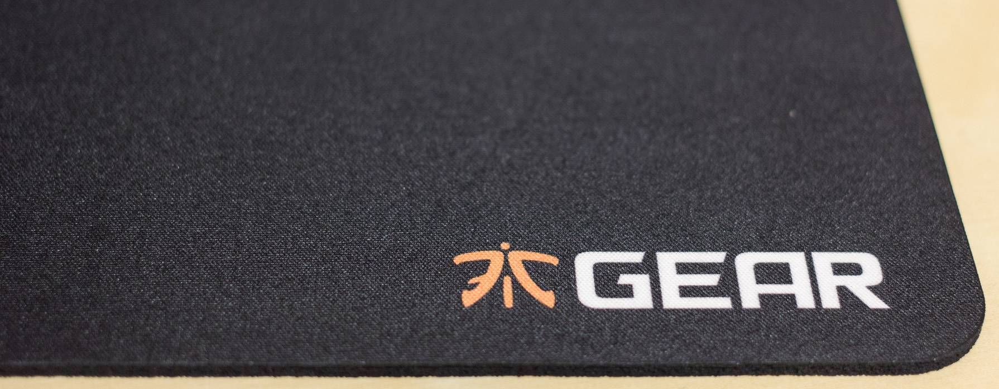

If you're familiar with gaming tournaments you've probably heard of Fnatic before. They have 5 different gaming teams, and you can usually find them dominating their opponents live on Twitch. That being said, I was pretty excited to check out the latest gaming peripherals they had to offer.

## Video Review


<iframe width="100%" height="404" src="https://www.youtube.com/embed/jGb0RztcLHo" frameborder="0" allowfullscreen></iframe>


## FLICK Optical Gaming Mouse Review

The Flick is a no nonsense gaming mouse, with a clean design, comfortable layout, and features the flawless Pixart 3310 optical sensor. 

### Specs
- MCU/Processor: Holtek HT68FB560
- Main switches: Omron
- Sensor: ADNS 3310
- Memory: 256 kB
- Resolution: 5000 CPI
- Frames per second: 6500
- Tracking speed: 130 IPS
- Max acceleration: 30g
- Report rate: Adjustable, up to 1000Hz
- Cable: 2 m braided USB 2.0
- Weight: 90g

### Comfort
The Flick is a very comfortable mouse. It features a soft touch finish that is easy to grip on to, and easy to clean. The mouse is also lightweight, coming in at only 90g. I found this weight to be comfortable for long hours of gaming and it didn't put any strain on my wrists. The mouse also has a drag reduction cable which comes out of the mouse at 30 degrees to prevent the cable from rubbing on your mouse pad. I found it held up to this claim very well, but I did notice the cable is very stiff. The mouse would could definitely be improved with a softer cable. The feet are very smooth and glide well on my Mionix mouse pad and the Focus mouse pad that I will be discussing later in this review.

Button placement on the mouse is also very good. I did not find myself accidentally pressing any of the side buttons or the profile switcher while using the mouse. Unfortunately the mouse does have one critical flaw with the scroll wheel. I found when scrolling up, I would press the middle mouse button by accident about 75% of the time. This could be fixed if the button was harder to press and by lowering the force required to scroll.

### Gaming and Sensor
As a Counter Strike player, I can definitely attest to the fact that a flawless sensor with no acceleration is necessary to play the game. The mouse should also perform under high acceleration with predictable results every time. The Flick uses the very popular Pixart 3310 which is a highly regarded sensor in the gaming community. I used this mouse to play Operation Wildfire in Counter Strike: Global Offensive, and I was very happy with the results. The sensor is accurate, and very confidence inspiring.

### Software
The Flick's software is very clean and easy to navigate. The mouse has the ability to store 3 separate profiles, each with basic settings, button assignments, color settings, and macros. If you're reinstalling your OS or switching PCs, you also have the option to backup and restore your settings.

#### Basic Settings

Basic settings allow you to set the CPI from 50 to 5000 in 50 CPI increments. You can also set 3 CPI levels which can be cycled through on the mouse if you have a button assigned to do so. Here you can also set up sensitivity, scroll speed, scroll by page, double click speed, and polling rate. Unfortunately at the time of this review you cannot adjust lift off distance, but hopefully this can be solved with a firmware update in the future.

#### Button Assignments

The Flick includes 8 programmable buttons including the scroll wheel. Here you can assign any button to do pretty much anything. I personally use one button to trigger my push-to-talk and another to play/pause my music. Of course, you can also set a button to perform a macro, and disable a button entirely.

#### Color Settings

The Flick features a RGB LED under the scroll wheel which can be controlled in the Color Settings tab. You can choose to have the LED on or off, cycle through every color, or set  it to a single color with the option to have it pulsate, heartbeat, blink, fade in, or fade out. I found the mouse gives off a soft glow that isn't distracting, and fades smoothly without any noticeable stepping.

#### Macro Recorder

The macro recorder is very easy to use. Simply click on the record button, and use your mouse and keyboard to set the macro. Press record again to stop, and give it a name. Your macros will now appear in the button assignments menu.

### Conclusion
The Flick is a pretty nice mouse overall, but it could be better. I would like to see a better scroll wheel without the miss-click issue, and I would also like the ability to adjust liftoff distance in the software. With these tweaks, the mouse would be perfect. It's lightweight, comfortable, has great software, and a flawless sensor. Hopefully we can see an updated version in the near future!

## Focus Mouse Mad Review

The Fnatic Focus is a soft mouse pad with a 3mm non-slip rubber grip. The Focus is an incredibly smooth mouse pad. I couldn't feel any feedback from the mouse pad at all compared to my Mionix Sargas 900 which is a bit rough. The mouse just glides effortlessly across the mouse pad. Wrist comfort is also excellent with this mouse pad. The 3mm rubber layer provides a soft area for your wrists to rest on.

Gaming with the Focus was great too. The surface tracked great with both laser and optical mice. I tested it with my Logitech G700 which has an ADNS 9500 Laser Sensor, and the Fnatic Flick which has a Pixart 3310 Optical Sensor. Tracking was smooth and provided a very nice surface to make small adjustments on. While testing with fast flicks, the mouse pad stayed in place and did not warp at all.

The Focus is available in 5 sizes:

- M: 280 x 214 x 3mm
- L: 340 x 260 x 3mm
- XL: 400 x 305 x 3mm
- XXL: 487 x 372 x 3mm
- Desktop: 950 x 450 x 3mm

### Conclusion
The Focus is a fantastic mouse pad. It's comfortable, tracks great, and is silky smooth. I can definitely recommend this product!

### Availability

Discontinued

###### Disclosures
I was not financially compensated for this review. Fnatic Gear provided the Flick and Focus samples for review. The opinions expressed in my review are my own based on my experience with the products.