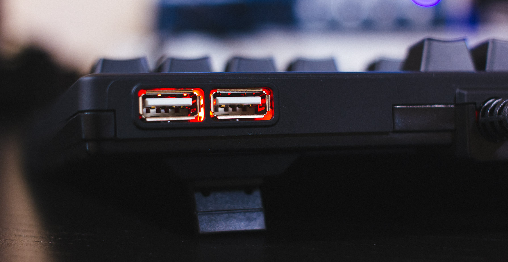
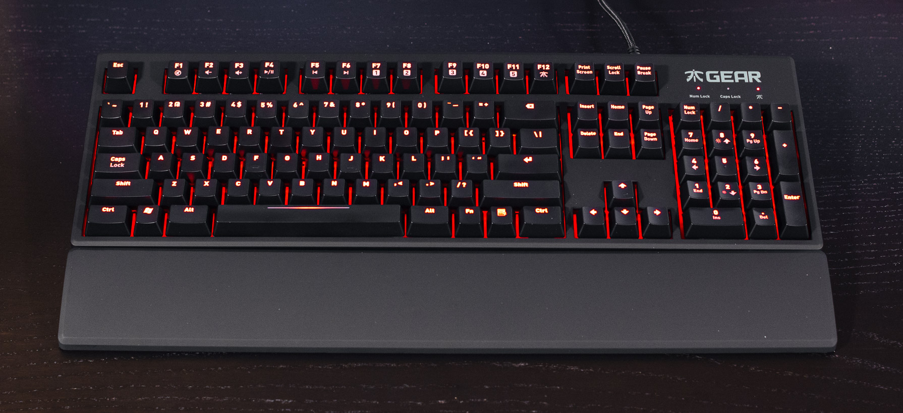
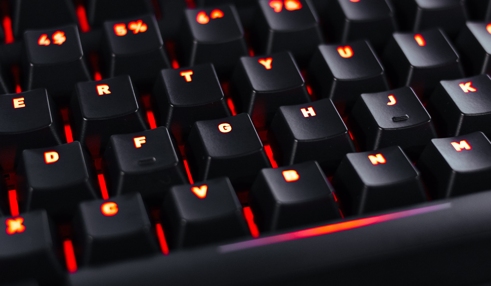
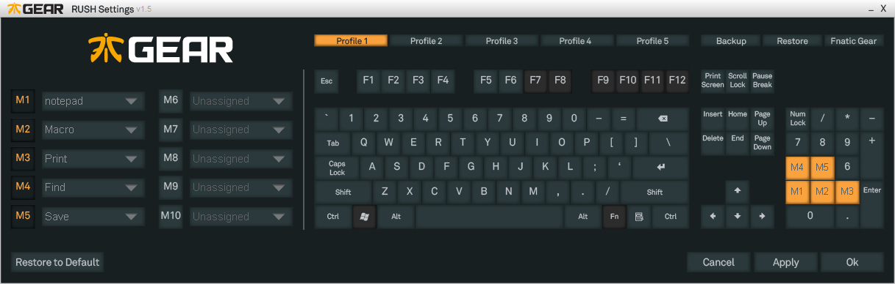
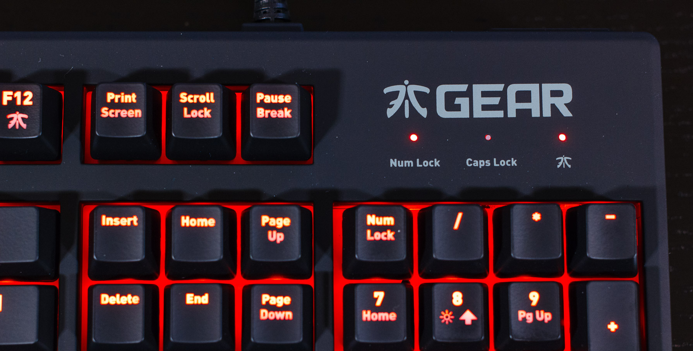

Last week I reviewed [Fnatic Gear's Flick mouse, and Focus mouse pad](/posts/fnatic-flick-focus/), which means it's time for the review of the Rush Mechanical Keyboard!

The Rush is a full size 104 key mechanical keyboard available in your choice of either Cherry MX Red, Blue, or Brown mechanical switches. The keyboard features a soft touch casing, red backlighting, and onboard storage for macros.

## Video Review


<iframe width="100%" height="404" src="https://www.youtube.com/embed/wXQlPIYtkzQ" frameborder="0" allowfullscreen></iframe>


## Build Quality and Features

The Rush is a solid keyboard! It's really heavy, and very rigid thanks to the red metal backplate holding the switches in place. The backplate also provides a nice surface for the red LEDs to reflect off of, which creates a smooth, even backlight. On the front of the keyboard, you'll find two notches where you can attach the included wrist wrest. On the back of the keyboard there's the 1.8 meter braided cable, and a two port USB 2.0 hub. This is great if you need to plug in a USB headset or a game controller. Another neat thing you can do with the hub is plug in a USB fan for those hot summer days. 

The Rush also includes a function layer with volume keys, media keys, a profile switcher, and Fnatic Gear Mode. Fnatic Gear mode disables the windows key, and enables the profile macros. You can also use the function button to set the backlight to either Low, Medium, High, and Pulsate.

## Comfort

The Rush includes a 2.5 inch wide plastic wrist wrest that's coated in the same soft touch finish as the rest of the board. It connects to the keyboard with two plastic clips and stays in place very nicely. The wrist rest is comfortable, and works great with the keyboard in the flat or raised positions.

In terms of key feel, the keycaps would definitely benefit from some more texture. I find they're too smooth, and can sometimes create friction and squeaking when typing fast.

## Keycaps

Being a backlit keyboard, the Rush uses 1mm thick translucent ABS keycaps with a black coating. Each key is individually lit by a 3mm red LED. Backlighting is smooth and even across most keys thanks to the red backplate, but multi row keys (Caps Lock / Function Row) have some dark spots. This seems to be a problem on most backlit boards using the old style Cherry switches, so hopefully we can see more boards using Cherry's new MX RGB translucent switches in the future. 

In terms of typing, the keycaps feel a bit too grippy for my tastes. I find the keycaps are too smooth because they have what seems like a toned town soft touch finish that doesn't have a pleasant texture to type on. The keycaps also tended to retain finger prints after typing or gaming for a long time. This is something that wouldn't be a problem if they keycaps just had some more texture to them.

## Software

The Rush has 5 programmable profiles, each with 10 slots for macros and Fnatic's built in functions. The software is simple to use, and stores macros directly on the keyboard's onboard storage which means you can take the keyboard with you, and not worry about a computer that doesn't have the software installed.

To set a macro, simply click on the macro slot, select a key to use, and then use the drop down menu to pick a pre-programmed macro, or create your own using the editor.

## Conclusion

Fnatic Gear's Rush Mechanical Keyboard is an interesting board. It features a very solid construction and has some neat features like the built in USB hub. Programing macros is simple, and it's nice to see they are stored on the onboard memory.  My only gripe with this keyboard is with the keycaps, but that is a very subjective area. It's really up to you to decide if you like the smoother/soft touch finish these keycaps offer.

## Availability
Discontinued

#### Disclosure
I was not financially compensated for this review. Fnatic Gear provided the Flick and Focus samples for review. The opinions expressed in my review are my own based on my experience with the products.
