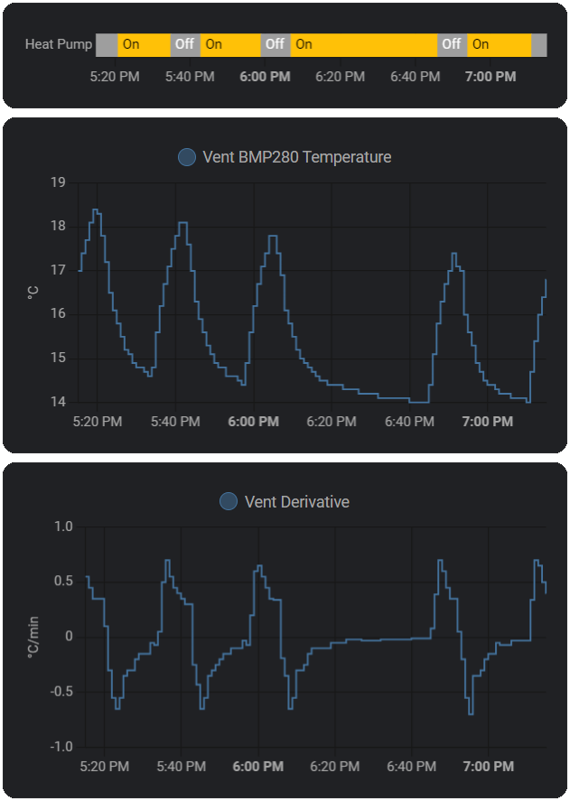

---
title: "How I use PowerCalc to Track Power Consumption in Home Assistant "
date: 2024-06-14T12:00:00-04:00
draft: false
tags: ["Home Assistant","Automation"]
cover:
    image: "powercalc.png"
    alt: "Home Assistant Energy Dashboard"
    relative: true # To use relative path for cover image, used in hugo Page-bundles
---

I was recently looking for a way to estimate power consumption in [Home Assistant](https://www.home-assistant.io/docs/energy/) without buying any additional hardware. I already have a Kill-A-Watt, so it's easy to just go around and start collecting data for 24/7 devices and devices with on/off states in Home Assistant.

[PowerCalc](https://github.com/bramstroker/homeassistant-powercalc) ties this data together with an easy to use integration.

### Intro ⚡

So why am I doing all this? First I want to shout out the amazing developers behind [HydroQC](https://hydroqc.ca/en/) which brings in data from Hydro-Quebec directly into Home Assistant. It's much faster, and updates more regularly vs Hydro's own website. Our Landis+Gyr Gridsream RF meters seemingly have a Zigbee radio inside, but it's disabled ☹️

So with this data in Home Assistant what more could I ask for? I want to know which devices are contributing to the totals I get from Hydro-Quebec. 

That's where [PowerCalc](https://github.com/bramstroker/homeassistant-powercalc) comes in. It creates virtual power sensors with your own data, or from their library.

### 24/7 Devices 🔌

For devices that are always on like your home network, you can create a **Daily Energy** sensor. 

**Network**
- Value: 50
- Unit: W
- Defaults to 1 day

I measured each device like my router, access points, switches, etc. I keep track of them in a spreadsheet so I can create a total value for the network power sensor.

For appliances that cycle on and off like a refrigerator, connect it to your Kill-A-Watt and measure over several days to calculate an average power. The more hours you measure, the more accurate it will be. For example 12 kWh / 48 Hours = 0.25 kW.

### Static loads with on/off states in Home Assistant 💡

For example a smart light switch with 8x 4 Watt LED bulbs.

**Virtual Power (manual)**\
Source Entity: switch.living_room

**Fixed Config**\
Power: 4

**Advanced options**\
Multiply Factor: 8

### Gaming PC with Steam 🎮

I wanted to try something more advanced, how much power is my PC using, and how much more when I'm playing a game.

First I set up [Wake on LAN](https://www.home-assistant.io/integrations/wake_on_lan/) to get the on/off state for my PC. You could also use the [Ping](https://www.home-assistant.io/integrations/ping/) integration.

```yaml
wake_on_lan:

switch:
  - platform: wake_on_lan
    mac: AA:BB:CC:DD:EE:FF
    name: PC
    host: 10.0.0.200
```

Then I hooked up my PC to a Kill-A-Watt and measured power consumption under normal use, and to make it more interesting, I tested in different games. 

With the [Steam](https://www.home-assistant.io/integrations/steam_online/) integration you can easily create a **Power Template** in PowerCalc to map games to different power levels.

**Power Template**

```yaml

  300

  385

  385

  120
 # All other games
  350

  85

```

You can also use the WoL sensor to trigger other fixed power devices like displays and other peripherals.

### Heat Pump 🥶

For heat pumps you can get a rough estimate of the power consumption by using the following formula:

BTU ÷ SEER = Watts

For example 24,000 BTU ÷ 10 SEER = 2400 Watts

If you have a smart thermostat you can easily trigger off that, or else you need to set up a temperature sensor and some helpers. You could also trigger off a light sensor if your machine turns on an LED when it's running.

Set up a [**Derivative**](https://www.home-assistant.io/integrations/derivative/) helper to watch a temperature sensor placed on a register reporting every minute. My settings are Precision: 2, Time Window: 2 minutes, Time Unit: Minutes.

Then set up a [**Template Binary Sensor**](https://www.home-assistant.io/integrations/template/) helper with the following template:

```yaml
 # On when temp drops -0.25 C / minute
  on
 # Off when temp increases 0.25 C / minute
  off
 # Steady state, hold on
  on
 
  off

```

You may have to tweak this for your own HVAC system. 



Come back in 6 months when I have to modify this for the winter to see how to actually do this properly 😉

It requires some additional logic to account for defrost cycles that I need live data to test with.

Honestly just buy a smart thermostat or see if your system has an LED you can attach a light sensor to and avoid all this nonsense. For an accurate reading there are current clamps you could use instead. 

### Final Thoughts

⚡[PowerCalc](https://github.com/bramstroker/homeassistant-powercalc) is a fantastic addition to Home Assistant, I wish I heard about it sooner. I'm looking for other ways to integrate stuff like my washer, dryer, hot water heater, etc, but I think current clamp sensors might be more realistic. And Hydro-Quebec gives me hourly data anyways so is it really necessary to go through the hassle.