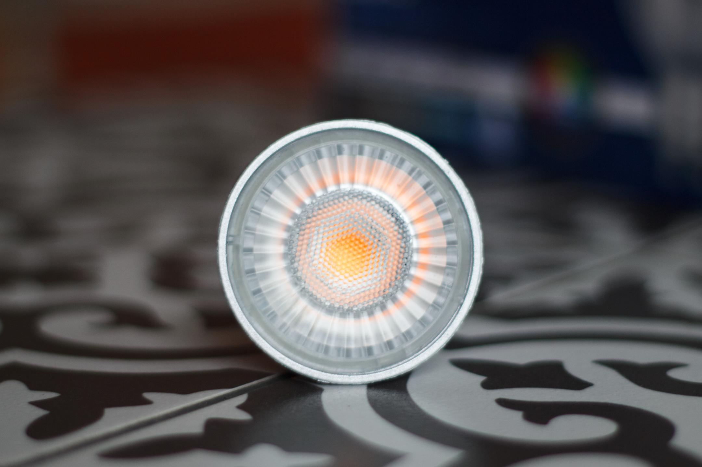
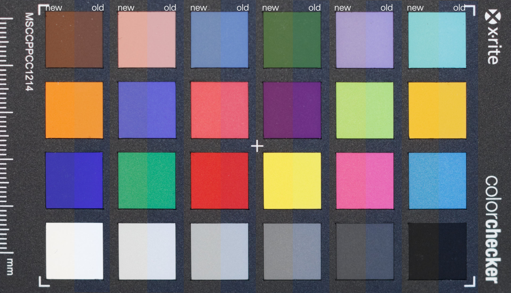
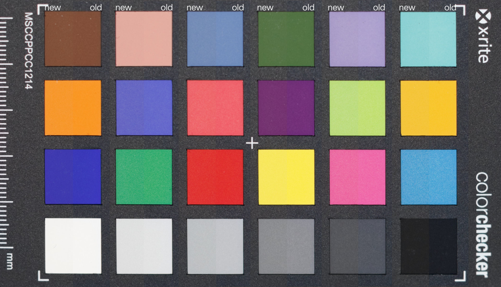

In November 2019 I purchased these Luminus GU10 spots at Costco. The big "Natural Colours CRI > 90" stamp on the box caught my eye. The price was too good to be true, $15.99 for 8 bulbs, and it turns out it was indeed. These lights fell far short of their rated specifications, exhibiting color shift and failing after a mere 1 year, 7 months, and 14 days. I used these lights anywhere from 8 to 14 hours every day for 591 days. That gives me an estimated runtime of 4728 to 8274 hours. Luminus claims a 25,000 hour runtime.

| Luminus | PLZ2033 | Notes |
|---|---|---|
| Base |  GU10 |  |
| CCT | 3000K | +335K after ~8000 hours |
| CRI | 90 | Energy Star R9: 54 |
| Lumens | 500 |  |
| Power | 7W |  |
| Lumens per watt | 71.4 | Not great |
| Runtime | 25,000 Hours | Not even close! |

## Construction

The bulb case is made of plastic, which is not a good heatsink. This design flaw leads to inadequate heat dissipation, resulting in subpar performance and longevity.

The lens has many small elements that disperse the light in a nice diffused pattern with no hotspots. There is one big COB led with a large phosphor in the middle which eliminates multiple shadows you sometimes see on LED bulbs that have many separated LEDs.



## Energy Efficiency

With only 71.4 lumens per watt these lights are far from state of the art efficiency. Other lights on the market are reaching well over 100 lumens per watt today.

For comparison, Philips has a [380 Lumen, 4 Watt GU10](https://www.energystar.gov/productfinder/product/certified-light-bulbs/details/2340872) bulb running at 95 lumens per watt.

Ikea has reached a staggering [160.7 Lumens per watt](https://www.energystar.gov/productfinder/product/certified-light-bulbs/details/2393573) on their new Solhetta 2700K lamp, using only 2.8W to produce 450 lumens. Very impressive, I'd like to try these out.

[Energy Star](https://www.energystar.gov/productfinder/product/certified-light-bulbs/) has a good database of bulbs you can use and sort by lumens per watt. The higher the efficiency, the less power is wasted as heat, the less likely the power supply will cook itself.

## Colour Shift and Output Reduction

Initially I was quite impressed with these lights. The colours are pleasing, and having 90+ CRI is excellent. They don't list the R9 but Energy Star claims 54 which is not fantastic, but better than most of the junk 80 CRI bulbs on the market that perform considerably worse.

After a bulb failed, I replaced it with a new one from the 8 pack. I noticed right away it looked brighter and warmer.

I used my X-Rite ColorMunki Display with the ArgyllCMS Spotread utility to measure the bulbs. The instrument was placed 130cm away from the test fixture.

`spotread -a -x T`

**New LED**
```
Result is XYZ: 419.885076 395.218502 166.819481, Yxy: 395.218502 0.427615 0.402494
Ambient = 395.2 Lux, CCT = 3150K (Duv 0.0008)
```

**2021 LED**

```
 Result is XYZ: 317.076090 305.580445 157.758933, Yxy: 305.580445 0.406291 0.391561
 Ambient = 305.6 Lux, CCT = 3485K (Duv 0.0002)
```

I measured a 23% reduction in output, and a 335 Kelvin increase in color temperature. Unfortunately my instrument is only a colorimeter and not a spectrophotometer so I cannot measure CRI or spectrum at this time.

My Canon T2i running Magic Lantern's Auto Adjust Kelvin feature measured 3000K on the new bulb, and 3300K on the old ones when aimed at an X-Rite ColorChecker Passport. A similar observation in color temperature shift.

### X-Rite ColorChecker Comparison

**Custom White Balance set to new light as reference**



The visible shift towards the cooler temperature is obvious if I set a reference custom white balance with the new bulb and compare it to the old bulb. You can also see the old bulb is darker.

**Custom White Balance set for each capture**

Here I set a custom white balance under each bulb so I could see if there were any major color errors. It seems to match pretty good so I'm pretty sure just the color temperature shifted. It's not a perfect match but pretty close. Exposure levels were matched in post.

## Failure Mode

The Luminus GU10 LED spots exhibited a specific failure pattern. They started flickering intermittently over the course of a week, flickering rapidly before experiencing a sudden drastic drop in output to about 1% for a few minutes until it finally burns out.

As mentioned earlier, these lights failed to surpass ~8000 hours of operation before exhibiting these issues. This falls significantly short of the manufacturer's claimed runtime of 25,000 hours.

These lights are not clearly not designed for daily operation such as a work from home environment. The power supply can't handle the heat generated by the inefficient circuit/LED.

## Always on "Moonlight" issue

This light suffers from a weird bug where it stays lit at a very low level while switched off. Steve Mould and ElectroBOOM have interesting videos about this phenomenon. It's the first time I've seen this problem in person.


\


## Conclusion

It's a shame really. I wanted to like these bulbs. While the price point is attractive, and the colors are pretty nice out of the box, the long term performance and short lifespan are disappointing. These lights are not ideal for all day operation like a work from home office. Luminus needs to do better marketing these bulbs. On the box it says "not for totally enclosed luminaires". As far as I am concerned a recessed fixture is not "totally enclosed". My fixtures have a large space behind with some ventilation cutouts and no front lens. If they can't handle the heat, stay out of the kitchen and write that on the box. While I was writing this review I discovered an [Energy Star page](https://www.energystar.gov/productfinder/product/certified-light-bulbs/details/2301907) for a similar model that says "Not Rated for Recessed Fixtures". Why was this not on the box? Why manufacture this e-waste garbage that can't be used in recessed fixtures? Most GU10 fixtures are recessed!

On Costco's website has none of this information is displayed leading to more unnecessary confusion.
[Costco.ca Luminus Elite](https://www.costco.ca/luminus-led-elite-7w-gu10-500-lumens-dimmable%2C-8-pack.product.100778123.html) / [Archive](https://archive.ph/ff1JS)

I am not going to recommend this light bulb for all day use. It would probably be fine in a closet or other places where the light is not powered on continuously for hours.