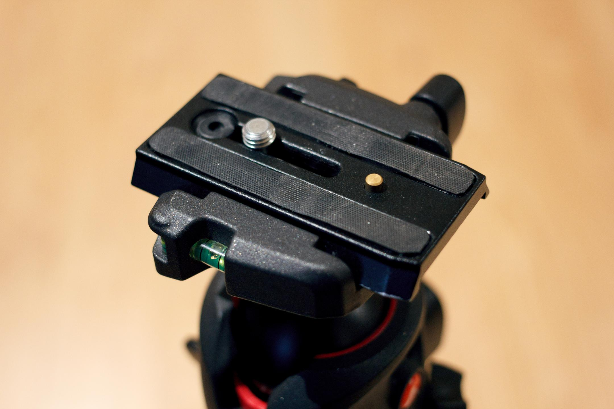
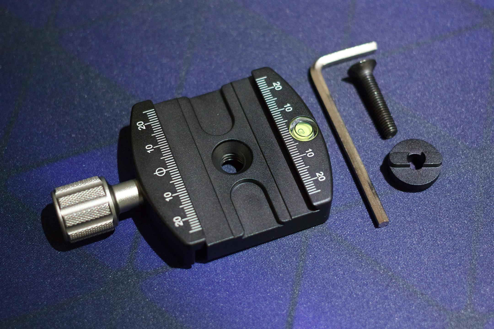
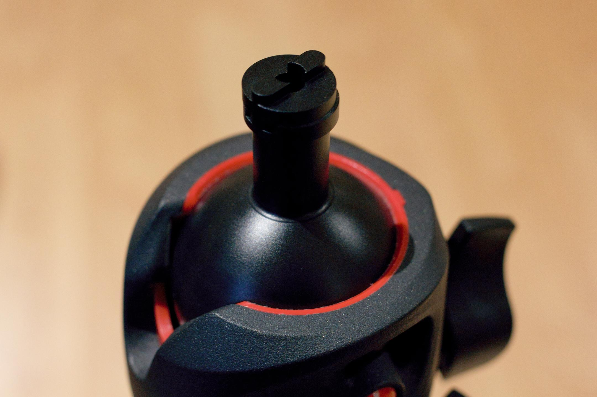
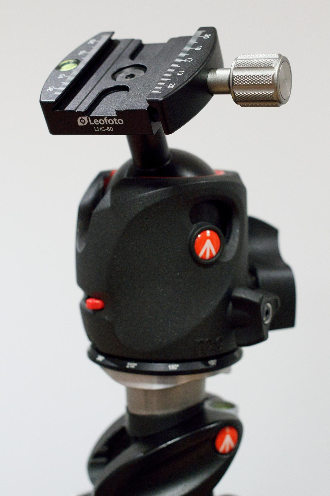

I was looking for a small tabletop tripod when I discovered pretty much all of them are using Arca-Swiss style quick release plates now. It seems like an interesting system, so I wanted to try it out on my trusty Manfrotto 055  Ball Head. I quickly learned Manfrotto clamps are custom and you need to use a small adapter boss to convert the Manfrotto anti-twist into a standard anti-twist post.

There are a few brands making these adapters:
- iShoot IS-5275JX (This is what I got, the Manfrotto stem part is a little too slim)
- Sunwayfoto  MAP-02
- Haoge Female to Male Boss Adapter
- Desmond DBAD

For the clamp I wanted something that looks nice and wouldn't look out of place. I discovered the very good looking and well machined **Leofoto LHC-60**. The clamp feels super high quality. The finish feels really premium, and the knob is knurled perfectly. A 70mm quick release plate is included with a split ring to tighten the screw if you don't have a screwdriver in the field. 

I'm really happy with the clamp. I'm certainly interested in trying some of their other gear.

*Stock Manfrotto 501PL Clamp*

*Leofoto LHC-60 with the iShoot adapter*

*The iShoot adapter on my Manfrotto ball head*

Looks pretty nice doesn't it.

Now back to my search for a compact tabletop tripod 😃

#### Disclosure

I purchased all the stuff in this article with my own funds.