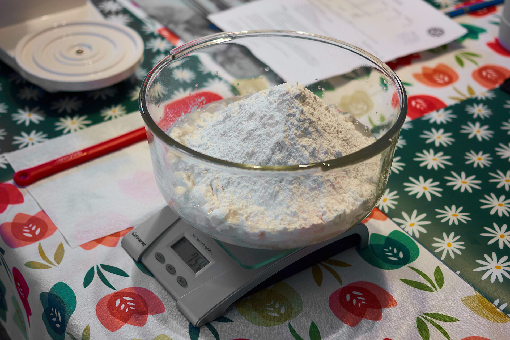
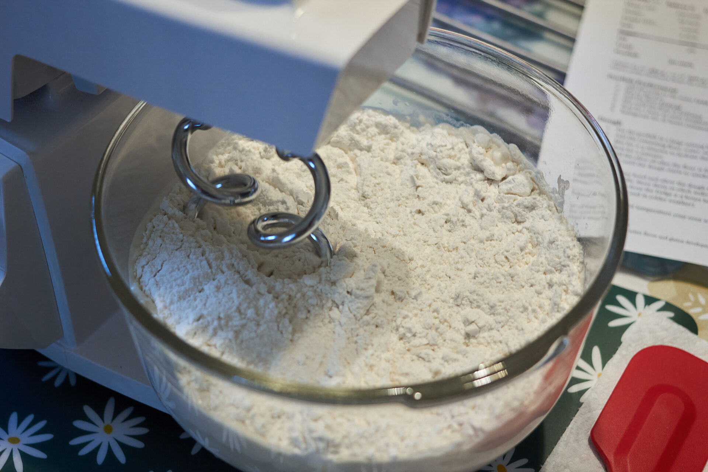
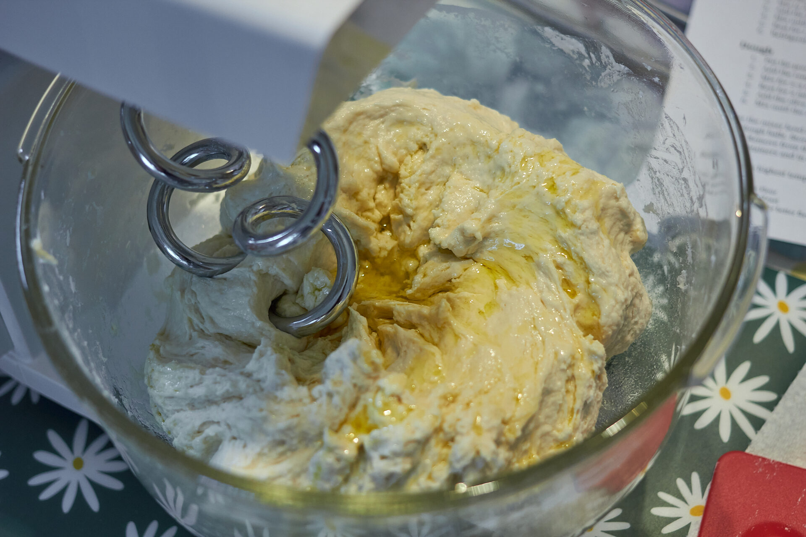
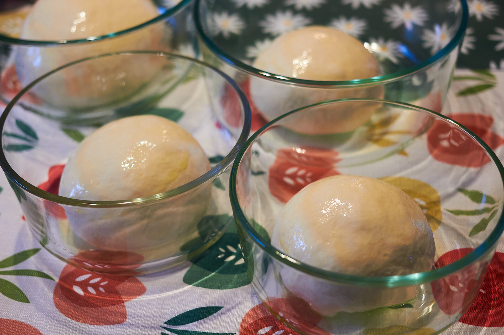
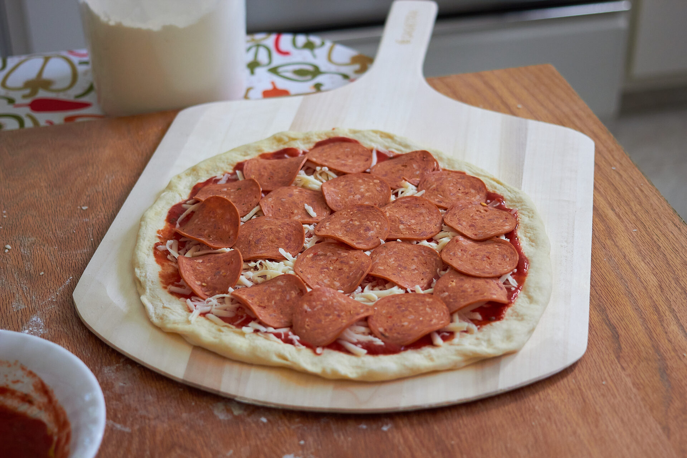
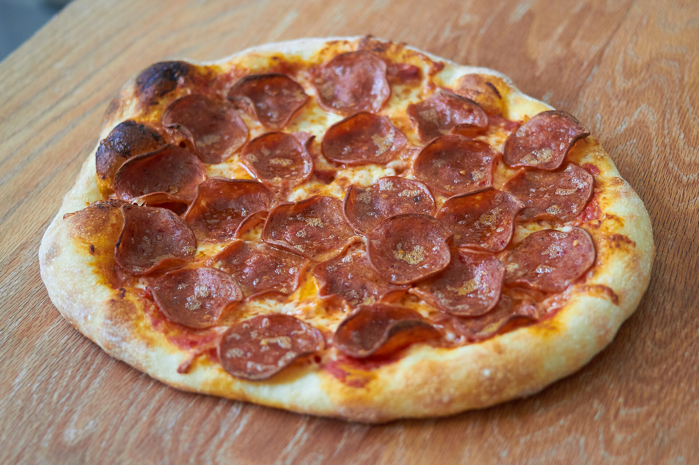
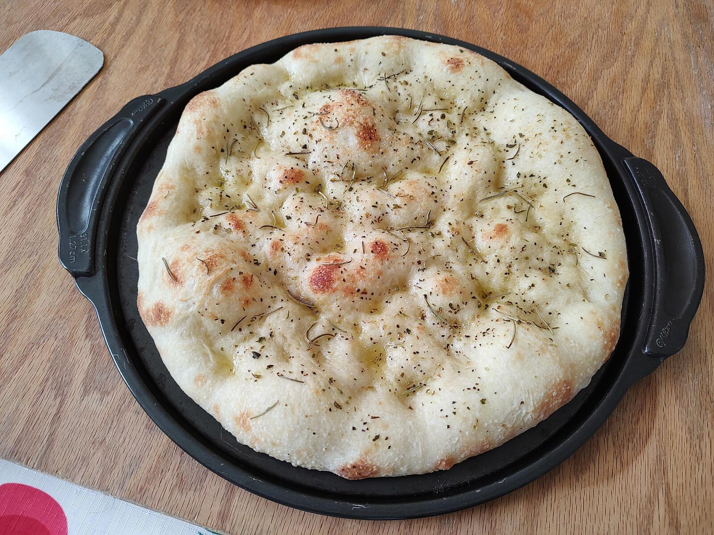

After months of experimentation, I have finally published my pizza dough recipe! This foolproof dough makes delicious pizzas at home. I hope you enjoy it as much as I do!

## Recipe

🕐 Prep time: 30 minutes · 🕐 Cook time: 6 minutes · 🍕 Yield: 4 pizzas

| Ingredients   | Bakers % | Grams |
| ------------- | -------: | ----: |
| Flour (AP/Bread) | 100%  | 608 |
| Water         | 60%      | 365 |
| Yeast (IDY)   | 0.50%    | 3 |
| Salt          | 2%       | 12 |
| Oil           | 2%       | 12 |
| Total         |          | 1000 |


    <label for="numBalls" style="padding-right: 0.2em;">Number of Dough Balls:</label>
    <input type="number" id="numBalls" value="4" min="1" oninput="calculateIngredients()" style="width:80px; font-weight: bold;">


**Makes 4 x 12" 250g dough balls**


       


[Print PDF 🖨️](pizza.pdf)

### Instructions 🍕

1. Mix the water, yeast, flour, and salt until fully incorporated
2. Add the olive oil after the flour is fully hydrated
3. Mix until the dough starts to become smooth and elastic
4. If the dough is tough, let it rest for 5-10 minutes to relax the gluten, then continue mixing until smooth.
5. Cover the bowl and let the dough  rise for 2-3 hours or until doubled in size. Weigh and form dough balls. Store in oiled, individual containers or in a proofing box. Refrigerate the dough balls for 1 to 7 days. Remove from the fridge 2-3 hours before baking.

### Baking 👨‍🍳

* Preheat the oven to its highest setting. My oven goes to 555°F.
* **Pizza Stone**: bake for 5-6 minutes or until golden

## Photos 📷

I start by measuring the water, yeast, flour and salt. In that order.

Always use a scale, if you see a pizza or bread recipe with measuring cups and spoons throw it in the trash! Using measuring cups can cause unnecessary variation and uncertainty.
 

Mixing the water, yeast and flour.

Add the olive oil after the flour and water have been incorporated. If the dough is tough at this stage I stop mixing and let the gluten relax for 5-10 minutes.

Finally weigh and form the dough balls. Place in individual oiled containers or a proofing box. Into the fridge for a few days to cold ferment!

My assembled pizza on the peel ready to launch. Be generous with the flour or semolina on the peel so it doesn't stick and throw all your toppings into your oven (Don't ask me how I know).

6 minutes later we have an excellent homemade pizza! Enjoy 😊

---

### Notes 📝

#### Yeast

I use Instant Dry Yeast (IDY)

#### Flour

For a home oven I recommend bread flour or all purpose flour (AP).   

#### Salt

Salt helps gluten development and slows fermentation. We want the dough to ferment slowly in the fridge. More time fermenting equals better flavour and aromas. 

2% is the ideal amount of salt.

#### Oil

Oil (fat) weakens gluten, reduces stickiness, and speeds up cooking for better crust. Oil should be added near the end of the mixing process. Oil should **never** be added to raw flour as it will coat the flour and inhibit the water from hydrating it. 

#### Water

The amount of water can vary depending on the flour. This is something you can adjust if your dough is too sticky or too dry. Higher hydration will make bigger bubbles, but at the expense of more time in the oven. Expect the crust to be crispier. Lower hydration will bake slightly faster and have a nice soft, dense, chewy texture. It's also easier to handle.

### A side note 📝

If you use about 500g of dough you can make a really delicious and fluffy focaccia or a fantastic Sicilian red pizza. Just bake it a little longer.

---

### Changelog

`2022-11-28:` Reduced hydration to 60% and oil to 2%. I find the dough easier too work with and less sticky. Cook time is also reduced by 1 minute.

`2024-05-16:` Added pizza dough calculator ✨



