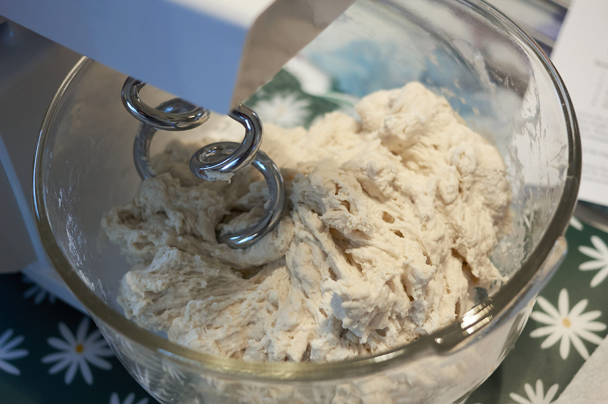

| Ingredients   | Bakers % | Grams |
| ------------- | -------: | ----: |
| Flour (AP/BR) | 100%     | 610   |
| Water         | 62%      | 378   |
| Yeast (IDY)   | 0.50%    | 3.1   |
| Salt          | 2%       | 12.2  |
| Oil           | 3%       | 18.3  |
| Total         |          | 1022  |

>**Makes 4 x 12" 255g dough balls**

[Print PDF 🖨️](pizza.pdf)

## Dough 🍕

1. Mix the flour, water, and yeast until fully hydrated
2. Add the salt and mix until combined
3. Add the olive oil
4. Mix until the dough starts to become smooth and elastic
5. If the dough is tough, let it rest for 5-10 minutes to relax the gluten, then continue mixing.

Cover the bowl and rise for 2-3 hours or until doubled in size. Weigh and form dough balls. Store in oiled, individual containers or in a proofing box. Refrigerate the dough balls for 1 to 7 days. Remove from the fridge 2-3 hours before baking.

## Baking 👨‍🍳

* Preheat the oven to its highest setting. My oven goes to 555°F.
* **Pizza Stone**: bake for 7 minutes
* **Aluminum Pizza Pan**: bake for 10 minutes

#### A side note 📝

If you use about 500g of dough you can make a really delicious and fluffy white pizza. Just cook it a little longer until it starts to crisp up.

## Photo dump

I start with measuring the water, adding the yeast, and finally the bread flour.

Always use a scale, if you see a recipe with measuring cups throw it in the trash! 
 

Mixing the water, yeast and flour.

This is when I add the salt. You can see the flour is fully hydrated.

After the salt is incorporated I add the olive oil. If the dough is tough at this stage I stop mixing and let the gluten relax for 5-10 minutes.

Finally weigh and form the dough into balls in individual containers with a touch of olive oil. You can also use a proofing box if you have one. Into the fridge for a few days to cold ferment.

My assembled pizza on the peel ready to launch. Be generous with the flour on the peel so it doesn't stick and throw all your toppings into your oven (Don't ask me how I know).

7 minutes later we have an excellent homemade pizza! Enjoy 😊

---

### Notes 📝

#### Yeast

I use Instant Dry Yeast (IDY)

#### Flour

For a home oven I recommend bread flour (BR) or all purpose flour (AP).   

#### Salt

Salt is necessary. It helps gluten development and slows fermentation. We want the dough to ferment slowly in the fridge. More time in fermentation equals better flavour.

2% is the ideal amount of salt.

Since salt absorbs water you need to wait until the flour is fully hydrated before adding it to the dough.

When to add the salt is debated amongst pizza makers, some dissolve the salt in the water before adding the yeast, some mix it into the flour to prevent the salt killing the yeast. I like to add it after the flour is hydrated. Sometimes if I'm in a rush I just add the salt to the flour at the beginning. The bottom line is you still get a delicious pizza 🤷‍♂️

#### Sugar

Sugar holds water and weakens gluten. It makes dough sticky. You don't want sugar in your dough. There are enough natural sugars in the dough as is to brown the crust.

#### Oil

Oil (fat) weakens gluten, reduces stickiness, and speeds up cooking for better crust. Oil should be added near the end of the mixing process. Oil should **never** be added to raw flour as it will coat the flour and inhibit water from hydrating it. 

