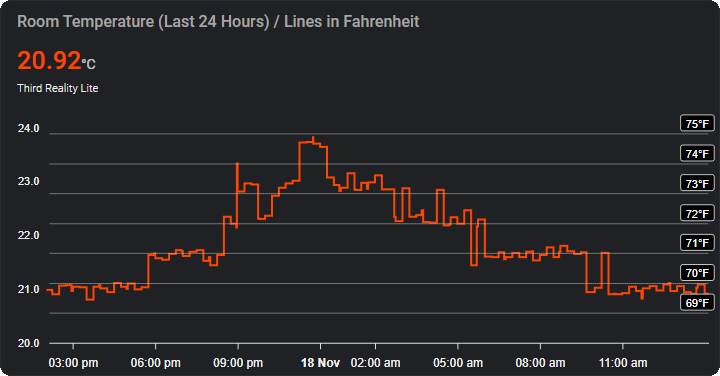
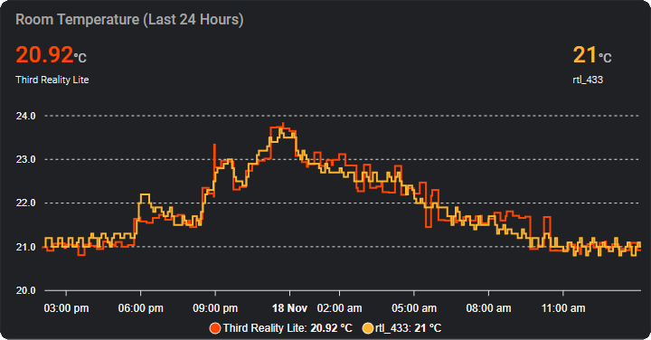
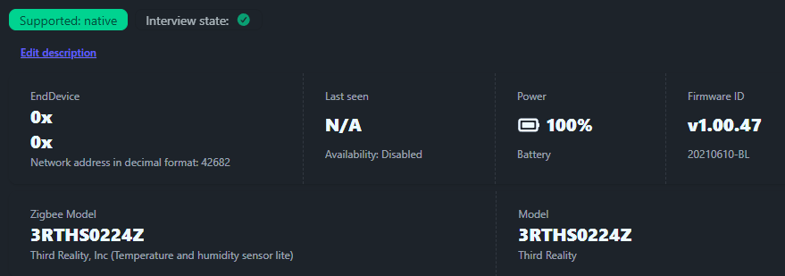

### Key Takeaways

- Temperature readings are rounded to the nearest 1°F. It gets get stuck around a certain temperature before snapping to the next 1°F bin. It doesn't keep up with my other sensors. 
- Temperature readings are very noisy despite two decimal places which I hoped would show small fluctuations smoothly. 
- Gradual temperature changes are jumpy when they should be smooth.
- Humidity sensor was off by +5% compared to my Acurite 01080M (SHT3x) and my DIY ESP8266 + SHT30 sensors.
- Reporting interval is 15 minutes, faster with large changes. Too slow.
- Zigbee connectivity is excellent

### Intro

I've been on the hunt for a Zigbee temperature sensor to help monitor my heat pump performance during the winter. I want to know where the balance point is where my heat pump can't keep up with the heat loss anymore. Once the room temperature starts falling I'll know the load is no longer matched, and I can turn on my supplemental heating.

Last winter I used a cheap 433 Mhz sensor with an RTL-SDR, but it only reports with one decimal place (which in hindsight was probably good enough), but I wanted more! I want to avoid sensors with disposable coin cell batteries, I much prefer using rechargeable batteries, and I already have a bunch of AA and AAA Ni-MH batteries ready to go.

### A good sensor with bad firmware

I landed on the Third Reality Temperature and Humidity Sensor Lite which seemed to fit the bill, it has a Sensirion sensor which I'm quite familiar with, and it was one of the rare Zigbee temperature sensors with 2 decimal places. Or so I thought... 

Thinking I found the perfect sensor, I was quite shocked to see the weird, almost ruler flat temperature readings being reported from this thing. This sensor really likes to report numbers close to the nearest 1°F for some reason. Call it rounding or quantization I guess? And the two decimal places I thought would help smooth out the data points? Well they just seem like pseudoramdom noise to me because of the rounding issue. Sure they go up and down somewhat correlated to my other sensors, but the readings seem to get stuck, with big jumps to the next temperature bin.

 
What's weird is it seems to snap or round to the nearest 1°F. It's really obvious when the temperature should be an in between value, but it outputs these massive 1°F swings for no reason, as if it's rounding up and down, behavior I do not observe on my other sensors.

When I plot the Third Reality against another wireless sensor placed next to each other, you can see the Third Reality sticks to one temperature range for a long time before snapping to the next range. This makes it completely unsuitable for observing small temperature changes over time, especially rising or falling over several hours. I want to see when my heat pump is running above, at, and below the heat loss of my house. I could have easily DIY'd with an ESP32, but I wanted something nice looking and wireless for my bedroom :(

What should be an even smoother line compared to my single decimal place sensor, is actually a jittery disaster.

Between 2:00 AM - 4:30 AM where the temperature should be pretty steady within 0.2°C, it's jumping back and forth by 0.5°C! It jumps as much as 1.0°C around 5:00 AM, and 10:00 AM for no reason.

For gradual temperature drop between 5 - 11 AM, the temperature goes from too low, to too high. At 9:30 AM it was off by 0.5°C, then snaps to the right temperature after it crosses the rounding threshold. 

This rounding should not happen with this much resolution.

### The Sensirion Sensor under the hood

I've been using SHT3x sensors for years, they are reasonable cheap and accurate enough for my needs. with 2 decimal places, I can easily see smooth temperature changes on my DIY ESPHome devices. They report every 2 minutes, and can easily detect when my HVAC is running for example. Even with the room temperature only rising and falling 0.1 C, I can easily see what's happening with 2 decimal places.

Third Reality claims to use a Sensirion sensor which I would expect to perform similarly to my own DIY sensors. This is why I don't understand why the readings stair step so much. My DIY sensors are buttery smooth, and never "lock on" to a temperature. They even made the effort to isolate the SHT on a little PCB island. What a waste.

As far as humidity, out of the box readings are +5% higher than my other Sensirion humidity sensors. My SHT30 and Acurite 01080M (SHT3x) read exactly the same when placed next to each other, so I trust them. Fortunately this can be easily calibrated in Zigbee2MQTT, so no big deal.

From what I can find from FCC internal photos, and some anecdotal posts online, this sensor uses a Sensirion SHT40 which is the newer generation compared to my SHT30. Their performance seems similar enough for this application, if not better on the new sensor.

Some details on the sensors:
- SHT30 Accuracy ±0.2°C ±2% RH.
- SHT40 Accuracy ±0.2°C ±1.8% RH

Wasted potential here. Extremely disappointing. 

### Zigbee stuff

Literally the second I pulled the battery tab out, this sensor paired instantly to my SLZB-06 running with Zigbee2MQTT. Nice! Great implementation. It also roamed to get a good connection in the mesh after I moved the sensor to another room.

The reporting interval is 15 minutes, and I've observed more frequent updates when it detects a large change in temperature. Though this still results in noisy data, despite the two decimal places.

### Decimal place disaster

So why am I so set on sensors with two decimal places you might ask? Generally the extra resolution is not necessary, and if you just want to know what the room temperature is, it really doesn't matter. 

What you gain with more resolution is the fine details. In a calm room with no heating or air conditioning running, you can literally see when you walk into a room, start a game on your PC, or even when your refrigerator is running, It's nuts. 

When you heat your home with a heat pump, eventually you get to the point where the load of the building no longer matches the BTU output of your heat pump. Though newer units are getting better and better, and if sized properly, they can run all winter with minimal auxiliary heating, besides the absolute coldest days below design temperature. For my unit, last winter I found it performs pretty well until about -10°C. Newer inverter "Hyper-Heat" heat pumps can easily go much lower while still maintaining a respectable COP, and being more efficient than electric heat strips.

Even with two decimal places, the temperature rounding/snapping issue makes the data very noisy. It's worthless for decision making and running automations.

### Conclusion

For now, with this defective firmware, this sensor is going back and I cannot recommend it.

Hopefully Third Reality fixes this, but I'm not going to be a beta tester for what this sensor costs, not when I can build my own with ESPHome that doesn't have these issues for less than half the price.

So the search continues. I'm quite interested in Ikea's new Matter over Thread sensors coming out soon. They use AAA batteries as well. If they update fast enough, they might even give me enough insight to my heat pump monitoring experiments. We shall see!

I also discovered in writing this that my rtl_433 sensor can actually show a second decimal point through WeeWX which will average the readings between reports every 5 minutes. This really helps smooth out the graphs. Nice!

Until next time, thanks for reading another pedantic review :)